# "Joint Savings Account" using Ethereum Solidity contract


### Background

Build a smart contracts to automate many of the institutions’ financial processes and features, such as hosting joint savings accounts.

Create a Solidity smart contract that accepts two user addresses to automate the creation of joint accounts. These addresses will be able to control a joint savings account. The smart contract will use ether management functions to implement a financial institution’s requirements for providing the features of the joint savings account. These features will consist of the ability to deposit and withdraw funds from the account.

### Output


A Solidity smart contract build in Remix editor that runs on JavaScript VM is created that shows the functionality of transferring funds to the contract and then withdrawing the funds from the contract in the 2 sample accounts held in the contract.

### Steps

The steps for this homework are divided into the following sections:

1. Created a Joint Savings Account Contract in Solidity

2. Compiled and Deployed the Contract in the JavaScript VM

3. Interacted with the Deployed Smart Contract

### The following ethereum address were used to setup the 2 accounts

    >
    > ```text
    > Dummy account1 address: 0x0c0669Cd5e60a6F4b8ce437E4a4A007093D368Cb
    > Dummy account2 address: 0x7A1f3dFAa0a4a19844B606CD6e91d693083B12c0
    > ```


The below address was used to check that the unauthorized withdrawals are not allowed

>>
    > ```text 
    0x0aAE2Ed794B9f1df9A9a9b2D5E04A144a8045F74
    > ```


### The following screenshots indicate the functionality of the smart contract

***Setting the 2 accounts using the Ethereum address***
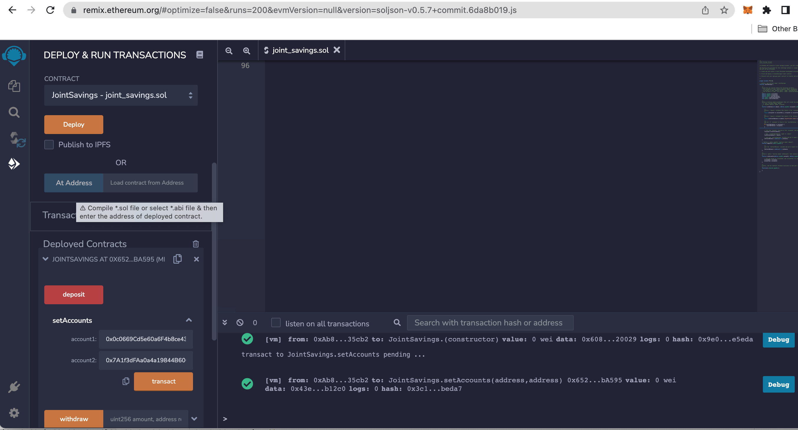
-
***Deposit 1 Ether as Wei to the contract***
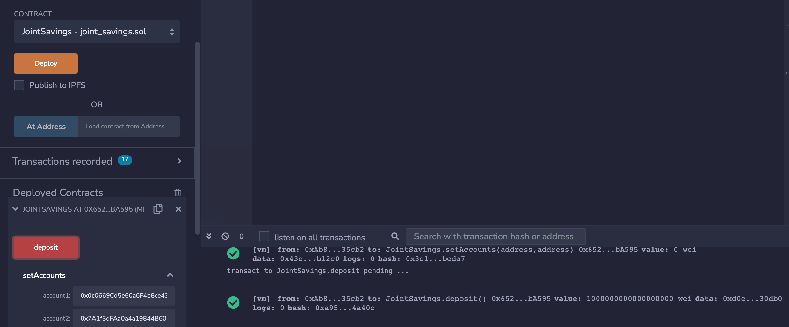
-
***Check the contract balance after depositing 1 Ether***
- As shown in the screenshot, the contract balance is shown as 1000000000000000000 Wei or 1 Ether
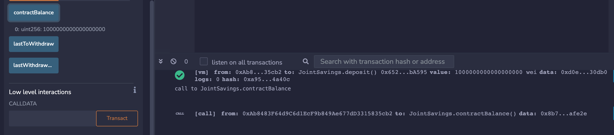
-
***Deposit 10 Ether as Wei to the contract***


-
***Check the contract address after depositing 10 Ether***
- As shown in the screenshot, the contract balance is shown as 11000000000000000000 Wei or 11 Ether
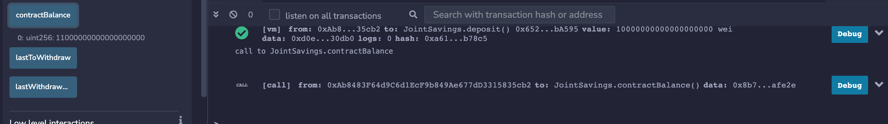

***Deposit 5 Ether to contract***
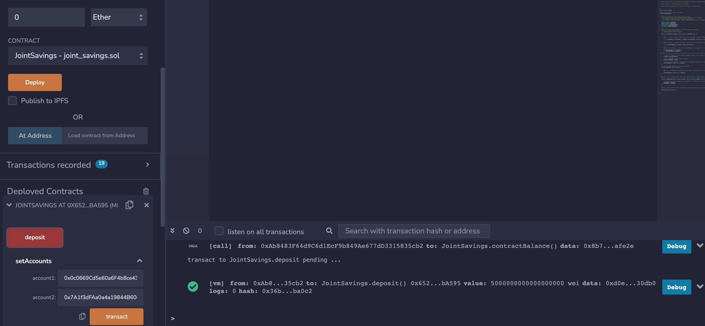

***Check contract balance after depositing 5 Ether***
- As shown in the screenshot, the contract balance is shown as 16000000000000000000 Wei or 16 Ether
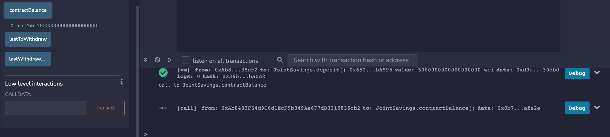

***Withdraw 5 Ether from account 1***
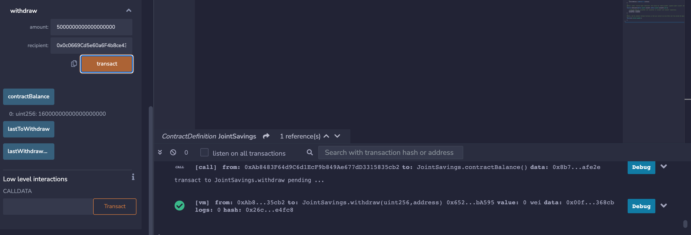

***Check contract balance after withdrawing 5 Ether from contract to account 1***
- As shown in the screenshot, the contract balance is shown as 11000000000000000000 Wei or 11 Ether
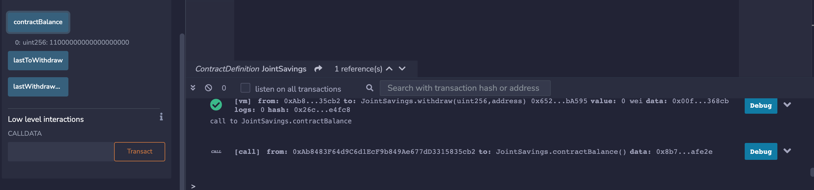


***Verify lastToWithdraw and lastWithdrawn amount***
-
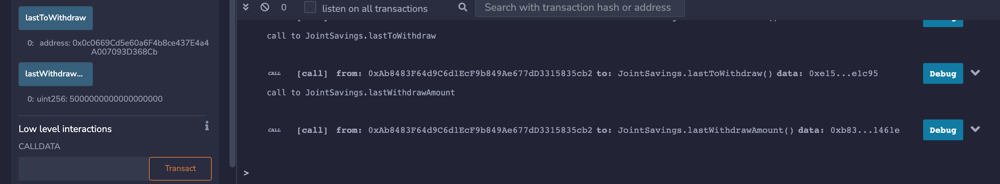
- As shown in the screenshot, the lastToWithdraw address is 0x0c0669Cd5e60a6F4b8ce437E4a4A007093D368Cb and the amount is 5000000000000000000 Wei or 5 Ether

***Withdraw 10 Ether from contract in Account 2 and check contract balance,lastToWithdraw and lastWithdrawnAmount***
- As shown in the screenshot, the lastToWithdraw address is 0x7A1f3dFAa0a4a19844B606CD6e91d693083B12c0 and the amount is 10000000000000000000 Wei or 10 Ether
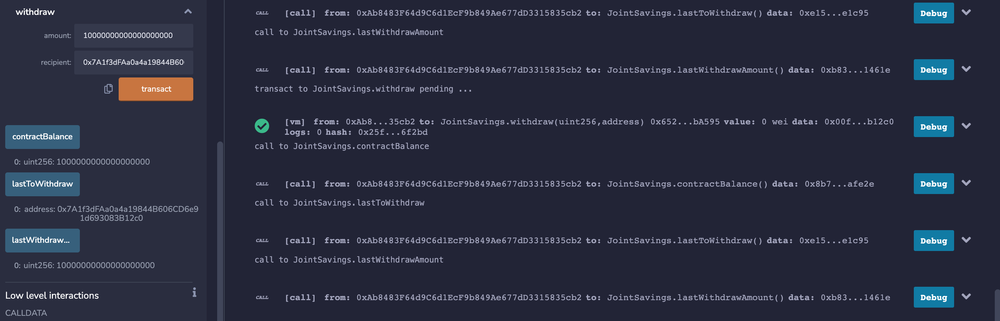

***Check validation to prevent withdrawal to unauthorized recipient***
- As shown in the screenshot, the error message returned is - "You don't own this account!"
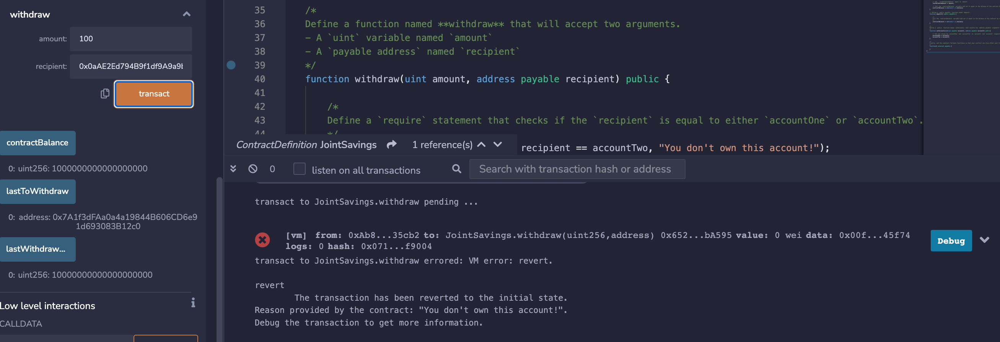

***Check validation for sufficient funds in account before withdrawal***
- As shown in the screenshot, the error message returned is - "Insufficient funds!"
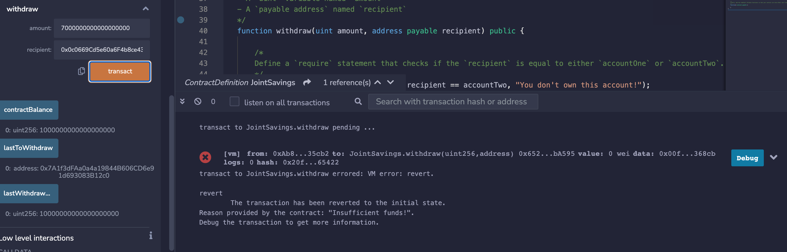


---

